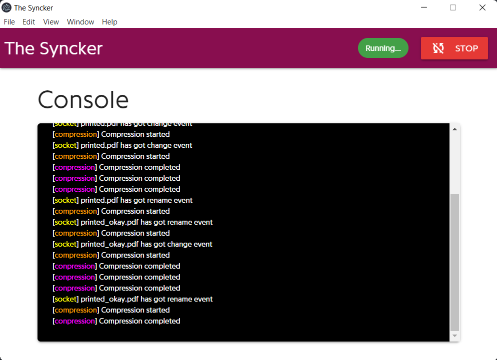

# the_syncker

A simple client-server socket.io based to synchronize a local folder with a remote host(the server) - dropbox kinda. It offers also an api to fetch media based on a certain folders structure 

